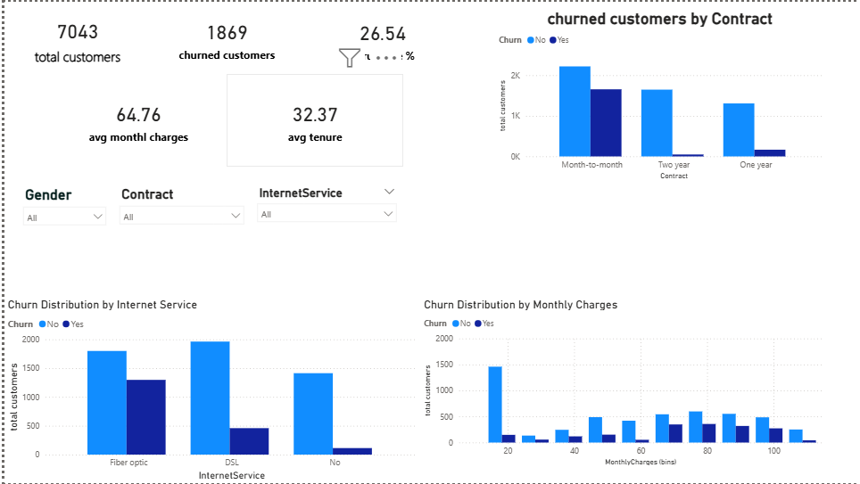
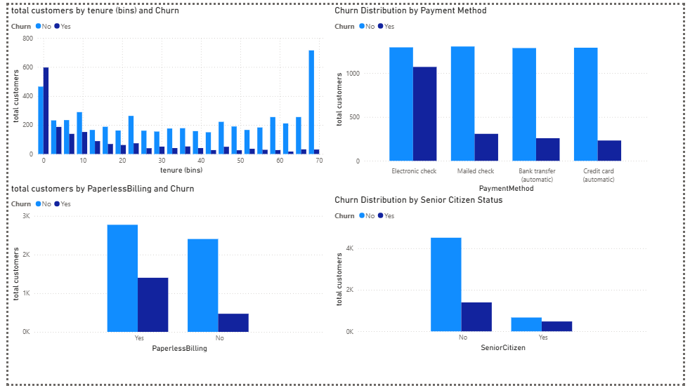
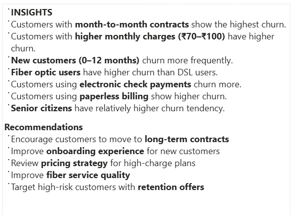

# 📊 Customer Churn Analysis (Power BI)

## 🔍 Overview

This project analyzes telecom customer data to identify patterns and factors influencing customer churn.

## 🛠 Tools Used

* Power BI
* Excel

## 📈 Key Insights

* Customers with month-to-month contracts have higher churn rates
* Higher monthly charges lead to increased churn
* New customers (low tenure) are more likely to churn
* Electronic check payment method shows higher churn

## 📷 Dashboard Preview

### Page 1

### Page 2

### Page 3

## 🚀 Conclusion

This project helps identify high-risk customers and improve retention strategies.
